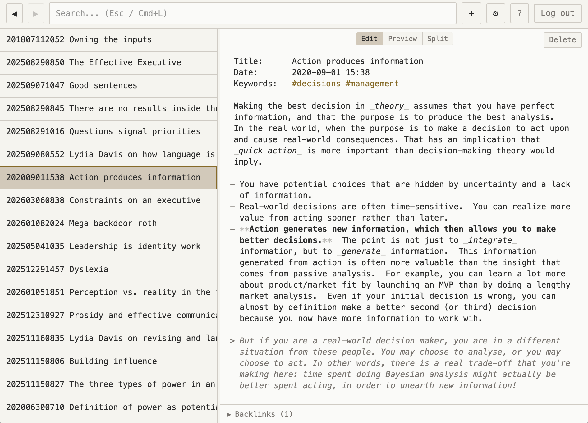

# Annex

A single-user, self-hosted notes web app — heavily inspired by [The Archive](https://zettelkasten.de/the-archive/) and designed to be used in concert with it. Notes are plain Markdown files on the filesystem with no database. Designed to be accessed from any browser after authenticating with a single password. Uses syncthing in the background to keep notes synced with a local copy on your desktop.

This software is the software I want to use; it is probably not the software that you want to use. I created this as an experiment — could I create, with Claude Code, a customized version of a piece of software that I use heavily? This is the result, and I can safely say that I would have been unable to do so on any reasonable schedule, and likely not to this level of quality.



## Features

- **Plain text notes** — `.md` files with `YYYYMMDDHHMM Title.md` naming convention, fully compatible with The Archive
- **Full-text search** — in-memory Flexsearch index with sub-millisecond results
- **Wiki-links and tags** — `[[note links]]` and `#tags` with autocomplete, clickable in both editor and preview
- **Live sync** — Syncthing keeps notes in sync between VPS and Mac; SSE pushes external changes to the browser in real time
- **Conflict detection** — etag-based optimistic concurrency prevents overwrites from concurrent edits
- **CodeMirror 6 editor** — Markdown syntax highlighting, auto-save, faded formatting marks, inline link decorations
- **Preview mode** — rendered Markdown with Edit / Preview / Split toggle
- **Backlinks and tags panel** — see what links to the current note and browse all tags
- **Keyboard-driven** — quick open, back/forward navigation, search focus, and more

## Stack

| Layer | Technology |
|-------|------------|
| Backend | Node.js 20, Fastify, TypeScript (tsx) |
| Frontend | React 18, Vite, CodeMirror 6, Tailwind CSS, Zustand |
| Auth | bcrypt + HTTP-only session cookie |
| Search | Flexsearch (server-side, in-memory) |
| Sync | Syncthing (VPS ↔ Mac) |
| Production | DigitalOcean VPS, Caddy (HTTPS), PM2 |

## Getting Started

### Prerequisites

- Node.js 20+
- npm

### Setup

```bash
npm install

# Set the login password (first time only)
npm run setup
```

### Development

Start the backend and frontend in separate terminals:

```bash
# Terminal 1 — backend (auto-restarts on change)
NOTES_DIR=~/Documents/TestNotes SESSION_SECRET=devsecretdevsecretdevsecretdevsecret PORT=3001 npm run dev:server

# Terminal 2 — frontend (HMR)
npm run dev
```

Open http://localhost:5173. Vite proxies `/api/*` to the backend on port 3001.

Point `NOTES_DIR` at any folder containing `.md` files — a dedicated test folder is recommended.

### Production Build

```bash
npm run build
NODE_ENV=production NOTES_DIR=/path/to/notes SESSION_SECRET=$(openssl rand -hex 32) npm start
# Open http://localhost:3000
```

## Testing

```bash
# Backend API tests (vitest)
npm test

# End-to-end tests (Playwright)
npm run test:e2e
```

## Deployment

Deployment is automated with Terraform (infrastructure) and Ansible (provisioning + deploys), orchestrated via a Makefile. See [SPEC.md](SPEC.md) Section 18 for full details.

```bash
# 1. Create the droplet + cloud firewall
make infra-init
make infra-apply

# 2. Provision the VPS (first time only)
make provision

# 3. Deploy the app
make deploy
```

Required environment variables: `DIGITALOCEAN_TOKEN`, `TF_VAR_ssh_key_name`, `SESSION_SECRET`. Copy `deploy.sh.example` to `deploy.sh` and fill in values.

## Project Structure

```
server/           # Fastify backend (auth, routes, file store, search index, SSE)
src/              # React frontend (components, store, hooks, editor)
ansible/          # Provision + deploy playbooks, Caddyfile template
terraform/        # DigitalOcean droplet + firewall IaC
test/             # Backend API tests (vitest)
e2e/              # End-to-end tests (Playwright)
```

## Setting Up Syncing

After deploying, open **Settings** (gear icon or `Cmd+,`) and scroll to the **Sync (Syncthing)** section.

### One-time setup

1. On your Mac, install Syncthing:
   ```bash
   brew install syncthing
   brew services start syncthing
   ```
2. Open http://localhost:8384 to access the Syncthing GUI on your Mac.
3. In **Annex Settings**, copy the server's Device ID (click "Copy").
4. In the **Mac Syncthing GUI**, go to *Add Remote Device* and paste the server's Device ID.
5. In the **Mac Syncthing GUI**, find your Mac's Device ID under *Actions > Show ID*.
6. Back in **Annex Settings**, paste your Mac's Device ID and click **Pair device**. This adds the Mac as a trusted device and shares the notes folder automatically.
7. In the **Mac Syncthing GUI**, accept the incoming folder share when prompted. Set the local path to your notes folder (e.g., `~/Documents/Zettelkasten`).

### After pairing

- The connection status dot in Settings shows **green** when connected, **yellow** when paired but not currently connected.
- Syncthing runs in the background — changes sync within 1-2 seconds.
- iCloud syncs from your Mac to iPhone/iPad as before.

### If Syncthing isn't provisioned

The Sync section will show "Syncthing is not configured on this server." Run `make provision` (or `FIRST_RUN=1 make provision` for a new droplet) to install Syncthing on the VPS first.


## Documentation

- [SPEC.md](SPEC.md) — full application specification
- [CLAUDE.md](CLAUDE.md) — development instructions and current status
